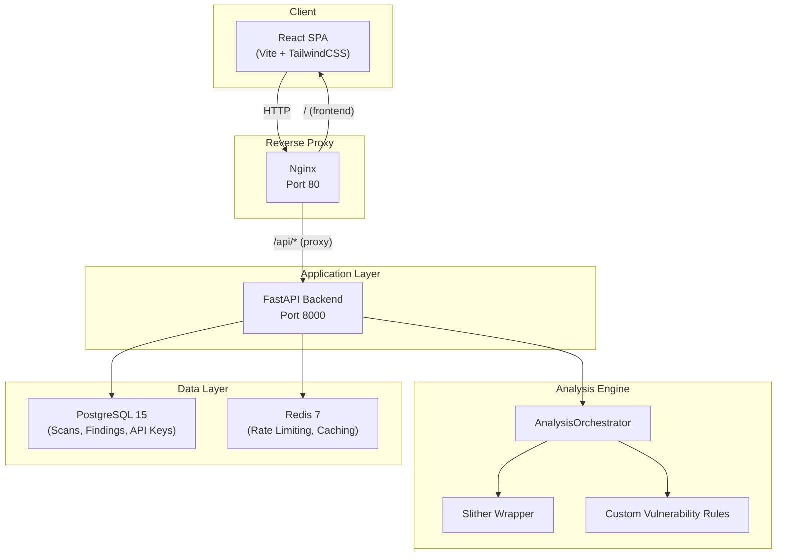
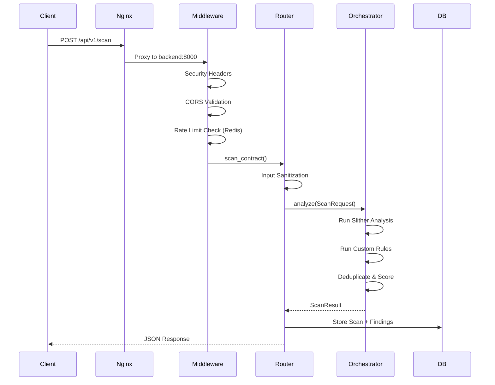
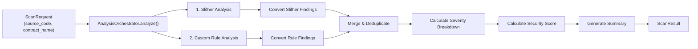
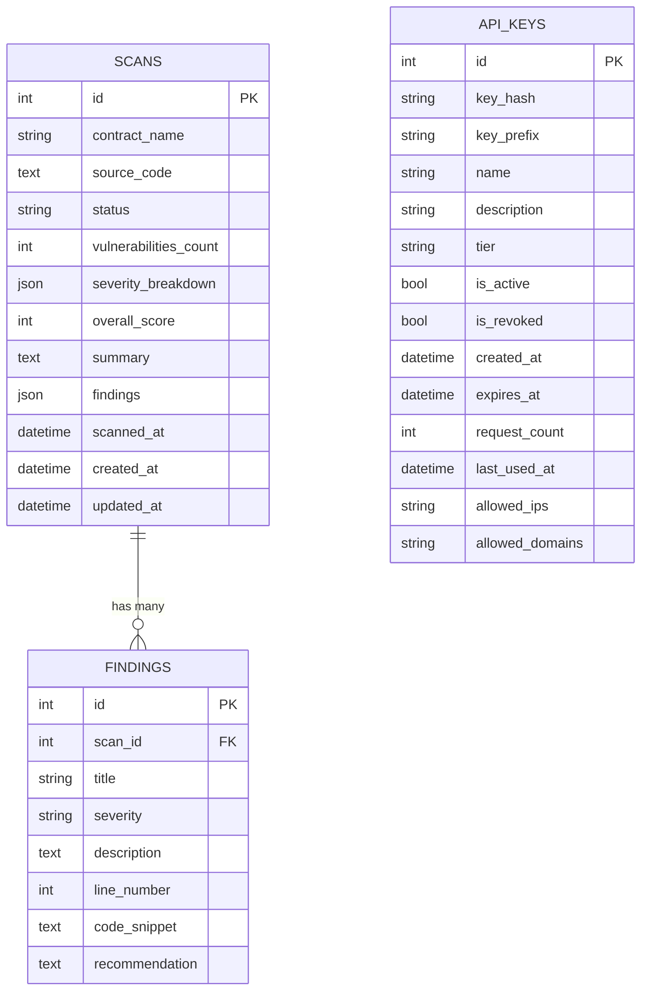
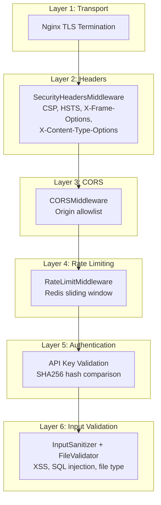

# BlockScope — Architecture Documentation

> Production-grade smart contract vulnerability scanner with ML-powered detection

---

## Table of Contents

- [System Overview](#system-overview)
- [High-Level Architecture](#high-level-architecture)
- [Technology Stack](#technology-stack)
- [Backend Architecture](#backend-architecture)
- [Analysis Pipeline](#analysis-pipeline)
- [Data Models](#data-models)
- [Security Architecture](#security-architecture)
- [Frontend Architecture](#frontend-architecture)
- [Infrastructure & Deployment](#infrastructure--deployment)
- [CI/CD Pipelines](#cicd-pipelines)

---

## System Overview

BlockScope is a full-stack security analysis platform that scans Solidity smart contracts for vulnerabilities. It combines **Slither static analysis** with **custom vulnerability detection rules** to produce scored security reports.

**Core capabilities:**
- Upload Solidity source code or `.sol` files via REST API
- Run automated vulnerability detection (Slither + custom rules)
- Deduplicate and score findings (0–100 security score)
- Store scan history with full audit trail
- Tiered API key authentication with rate limiting

---

## High-Level Architecture



### Request Flow



---

## Technology Stack

| Layer | Technology | Version | Purpose |
|-------|-----------|---------|---------|
| **Frontend** | React | — | UI Components |
| **Build Tool** | Vite | — | Dev server & bundling |
| **Styling** | TailwindCSS | — | Utility-first CSS |
| **Backend** | FastAPI | — | Async REST API |
| **Runtime** | Python | 3.11 | Backend runtime |
| **ORM** | SQLAlchemy | — | Database abstraction |
| **Validation** | Pydantic + Pydantic Settings | — | Schema validation & config |
| **Database** | PostgreSQL | 15 | Primary data store |
| **Cache** | Redis | 7 | Rate limiting & caching |
| **Analysis** | Slither | — | Solidity static analysis |
| **Proxy** | Nginx | stable-alpine | Reverse proxy |
| **Containers** | Docker + Docker Compose | — | Orchestration |
| **CI/CD** | GitHub Actions | — | Automated pipelines |
| **Node.js** | Node | 20 | Frontend build |

---

## Backend Architecture

### Directory Structure

```
backend/
├── app/
│   ├── main.py              # FastAPI application entry point
│   ├── core/
│   │   ├── config.py         # Pydantic Settings (all env vars)
│   │   ├── database.py       # SQLAlchemy engine + session factory
│   │   ├── auth.py           # API key authentication system
│   │   ├── security.py       # Security middleware & validators
│   │   ├── rate_limit.py     # Redis sliding-window rate limiter
│   │   └── logger.py         # Structured logging
│   ├── routers/
│   │   └── scan.py           # Scan API endpoints
│   ├── models/
│   │   ├── scan.py           # SQLAlchemy Scan + Finding models
│   │   └── finding.py        # Normalized Finding model
│   └── schemas/
│       └── scan_schema.py    # Pydantic request/response schemas
├── analysis/
│   ├── orchestrator.py       # Analysis pipeline coordinator
│   ├── scanner.py            # Rule-based scanner
│   ├── slither_wrapper.py    # Slither integration
│   ├── models.py             # Analysis Pydantic models
│   └── rules/
│       └── base.py           # VulnerabilityRule base class + Finding dataclass
├── alembic/                  # Database migrations
├── tests/                    # Pytest test suite
└── requirements.txt          # Python dependencies
```

### Application Bootstrap (`main.py`)

The FastAPI application initializes in this order:

1. **Load configuration** — `Settings` from `core/config.py` (Pydantic Settings with env validation)
2. **Create FastAPI app** — with conditional docs endpoints (`/docs`, `/redoc`)
3. **Startup event** — test database connection, initialize tables, print config summary
4. **Register middleware** (in order):
   - `SecurityHeadersMiddleware` — OWASP security headers on every response
   - `CORSMiddleware` — configurable origin allowlist
   - `RateLimitMiddleware` — Redis-backed sliding window (when enabled)
5. **Register exception handlers** — custom 404 and 500 responses
6. **Mount routers** — scan router at `/api/v1`
7. **Debug routes** (dev only) — `/debug/routes`, `/debug/config`

### Configuration System (`core/config.py`)

All configuration is managed through **Pydantic Settings** with comprehensive validation:

- **Environment files**: loads from `.env.development` or `.env` (configurable per environment)
- **Validators**: environment name, log level, database URL format, secret key strength, JWT algorithm, CORS origins, file extensions, SMTP config, admin password
- **Computed properties**: `database_url_sync`, `database_url_async`, `redis_url_str`, `is_development`, `is_production`
- **Caching**: `@lru_cache` ensures settings are loaded only once

---

## Analysis Pipeline

The `AnalysisOrchestrator` is the core of BlockScope's scanning capability.

### Pipeline Flow



### Components

| Component | File | Responsibility |
|-----------|------|---------------|
| `AnalysisOrchestrator` | `analysis/orchestrator.py` | Coordinates the full pipeline |
| `SlitherWrapper` | `analysis/slither_wrapper.py` | Wraps Slither binary for contract parsing |
| `SmartContractScanner` | `analysis/scanner.py` | Runs registered `VulnerabilityRule` instances |
| `VulnerabilityRule` | `analysis/rules/base.py` | Abstract base class for custom detection rules |
| `Finding` (dataclass) | `analysis/rules/base.py` | Rule-level finding with `rule_id`, `severity`, `confidence` |
| `Finding` (Pydantic) | `analysis/models.py` | API-level finding with `title`, `recommendation` |

### Security Scoring Algorithm

The orchestrator calculates a **security score from 0–100**:

```
score = 100 - (10 × critical) - (5 × high) - (2 × medium) - (1 × low)
score = max(0, score)  # Floor at 0
```

### Deduplication Strategy

When the same issue is found by both Slither and custom rules:
- Match on **same severity + same line number**
- Keep the finding with the **longer description** (more detail)

---

## Data Models

### Database Models (SQLAlchemy)



### Analysis Models (Pydantic)

| Model | Module | Purpose |
|-------|--------|---------|
| `ScanRequest` | `analysis/models.py` | Input: `source_code`, `contract_name`, `file_path` |
| `ScanResult` | `analysis/models.py` | Output: findings, score, severity breakdown, summary |
| `Finding` | `analysis/models.py` | Individual vulnerability with recommendation |
| `ScanRequest` | `app/schemas/scan_schema.py` | API request: `source_code`, `contract_name` |
| `ScanResponse` | `app/schemas/scan_schema.py` | API response: `scan_id`, score, findings, timestamp |

---

## Security Architecture

### Layered Security Model



### API Key Authentication

- **Key generation**: 32-byte cryptographically random key with `bsc_` prefix
- **Storage**: only SHA256 hash stored in database (raw key shown once)
- **Tiers**: `free`, `basic`, `premium`, `enterprise` — each with different rate limits
- **Features**: IP allowlisting, domain restrictions, expiration dates, revocation
- **Header**: `X-API-Key`

### Rate Limiting

- **Algorithm**: Redis sorted-set sliding window
- **Identifier priority**: API key → User ID → IP address
- **Default limits** (unauthenticated): 20/min, 100/hour, 1,000/day
- **Authenticated limits**: 60/min, 500/hour, 5,000/day
- **Burst allowance**: configurable via `RATE_LIMIT_BURST`
- **Response headers**: `X-RateLimit-Limit`, `X-RateLimit-Remaining`, `X-RateLimit-Reset`

### Input Validation

| Validator | Protects Against |
|-----------|-----------------|
| `InputSanitizer.sanitize_string()` | Script injection, null bytes, control characters |
| `InputSanitizer.sanitize_html()` | XSS via HTML tags |
| `InputSanitizer.sanitize_filename()` | Path traversal (`../`) |
| `FileValidator.validate_file()` | Malicious uploads (size, extension, MIME, content) |
| `SQLValidator.is_safe_order_by()` | SQL injection in ORDER BY |

---

## Frontend Architecture

### Structure

```
frontend/
├── src/
│   ├── App.jsx              # Main application component
│   ├── main.jsx             # React entry point
│   ├── apiClient.js         # Axios HTTP client
│   ├── utils.js             # Utility functions
│   ├── ErrorBoundary.jsx    # React error boundary
│   ├── components/          # Reusable UI components
│   ├── App.css              # Component styles
│   └── index.css            # Global styles
├── index.html               # HTML entry point
├── vite.config.js           # Vite configuration
├── tailwind.config.js       # TailwindCSS configuration
└── package.json             # Node dependencies
```

- **Framework**: React (JSX)
- **Build tool**: Vite with HMR for development
- **Styling**: TailwindCSS + PostCSS
- **HTTP client**: Axios (`apiClient.js`)
- **Error handling**: React Error Boundary wrapper
- **Testing**: Vitest

---

## Infrastructure & Deployment

### Docker Architecture

| Dockerfile | Base Image | Purpose | Features |
|-----------|-----------|---------|----------|
| `Dockerfile.backend.dev` | `python:3.11-slim` | Dev backend | Hot-reload with `--reload` |
| `Dockerfile.backend.prod` | `python:3.11-slim` (multi-stage) | Prod backend | Non-root user, 4 workers |
| `Dockerfile.frontend.dev` | `node:20-alpine` | Dev frontend | Vite HMR |
| `Dockerfile.frontend.prod` | `node:20-alpine` → `nginx:stable-alpine` (multi-stage) | Prod frontend | Static files via Nginx |

### Container Topology

**Development** (`docker-compose.yml`):

| Service | Container | Port | Notes |
|---------|-----------|------|-------|
| `db` | `blockscope_db` | 5432 | PostgreSQL 15 Alpine |
| `redis` | `blockscope_redis` | 6379 | Redis 7 Alpine with AOF |
| `backend` | `blockscope_backend` | 8000 | Hot-reload, volume-mounted |
| `frontend` | `blockscope_frontend` | 5173 | Vite HMR, volume-mounted |

**Production** (`docker/docker-compose.prod.yml`):

| Service | Container | Resource Limits | Resource Reservations |
|---------|-----------|----------------|----------------------|
| `backend` | `blockscope-backend` | 1 CPU, 1 GB | 0.5 CPU, 512 MB |
| `frontend` | `blockscope-frontend` | 0.5 CPU, 512 MB | 0.25 CPU, 256 MB |
| `postgres` | `blockscope-postgres` | 1 CPU, 1 GB | 0.5 CPU, 512 MB |
| `redis` | `blockscope-redis` | 0.5 CPU, 512 MB | 0.25 CPU, 256 MB |
| `nginx` | `blockscope-nginx` | 0.5 CPU, 256 MB | 0.25 CPU, 128 MB |

### Nginx Configuration

- **Production proxy** (`nginx.conf`): routes `/` → frontend:80, `/api/` → backend:8000
- **Frontend serving** (`frontend.conf`): SPA fallback (`try_files $uri /index.html`), 30-day static asset caching

### Operations Scripts

| Script | Purpose |
|--------|---------|
| `scripts/deploy.sh` | Stop → Build → Start production containers |
| `scripts/rollback.sh` | Restore database from backup file, restart services |
| `scripts/backup.sh` | PostgreSQL `pg_dump` to compressed `.sql.gz` |
| `scripts/health-check.sh` | Verify backend and frontend are responding |

---

## CI/CD Pipelines

Four GitHub Actions workflows automate quality and deployment:

| Workflow | Trigger | Jobs |
|----------|---------|------|
| **Backend CI** | Push/PR to `main`, `develop` (backend paths) | Lint (Flake8 + Bandit) → Test (Python 3.10, 3.11) with Postgres + Redis → Coverage upload |
| **Frontend CI** | Push/PR to `main`, `develop` (frontend paths) | ESLint → Vitest with coverage → Production build |
| **Docker Build** | Push/PR to `main` (docker/backend/frontend paths) | Build & push backend + frontend images to GHCR |
| **Deploy Staging** | Push to `main` or manual dispatch | Build images → Deploy to staging → Health check |

### CI Features
- **Concurrency groups** prevent duplicate runs
- **Matrix testing** across Python 3.10 and 3.11
- **Service containers** for PostgreSQL and Redis in CI
- **Artifact uploads** for test results, coverage, and security reports
- **Codecov integration** for coverage tracking
- **GHCR** (GitHub Container Registry) for Docker image hosting
- **Docker layer caching** via GitHub Actions cache
