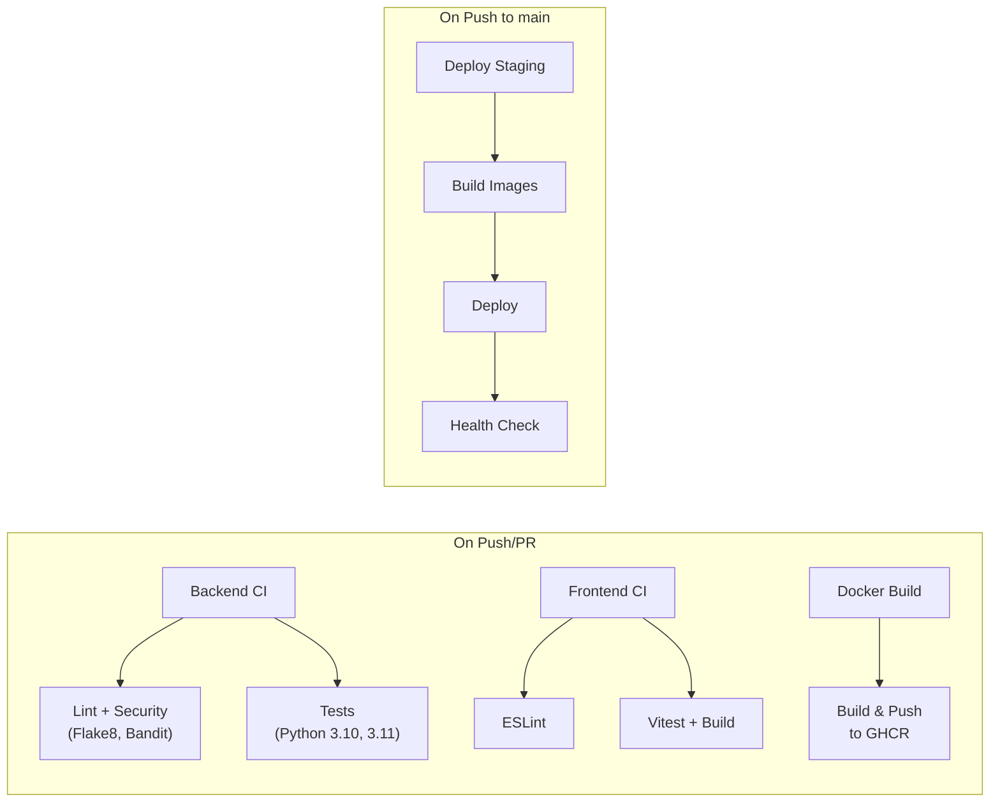

# BlockScope — Deployment Guide

> Step-by-step instructions for deploying BlockScope in development and production environments

---

## Table of Contents

- [Prerequisites](#prerequisites)
- [Local Development Setup](#local-development-setup)
- [Production Deployment](#production-deployment)
- [Environment Configuration](#environment-configuration)
- [Database Management](#database-management)
- [Operations Scripts](#operations-scripts)
- [CI/CD Pipeline](#cicd-pipeline)
- [Monitoring & Health Checks](#monitoring--health-checks)
- [SSL/TLS Configuration](#ssltls-configuration)

---

## Prerequisites

| Requirement | Version | Purpose |
|------------|---------|---------|
| Docker | 20.10+ | Container runtime |
| Docker Compose | v2+ | Multi-container orchestration |
| Git | 2.30+ | Source control |
| Node.js | 20+ | Frontend build (local dev without Docker) |
| Python | 3.11+ | Backend (local dev without Docker) |

**System Requirements (Production):**
- **CPU**: 2+ cores recommended
- **RAM**: 4 GB minimum (production containers total ~3.5 GB limits)
- **Disk**: 10 GB+ for images, volumes, and logs

---

## Local Development Setup

### 1. Clone the Repository

```bash
git clone https://github.com/harshilnayi/BlockScope.git
cd BlockScope
```

### 2. Configure Environment

```bash
# Copy the example env file
cp backend/.env.example backend/.env.development

# Edit with your local settings (the defaults work out of the box for Docker)
# Key values to verify:
#   DATABASE_URL=postgresql://blockscope_dev:dev_password_123@db:5432/blockscope_dev
#   REDIS_URL=redis://redis:6379/0
```

### 3. Start All Services

```bash
# Start the full stack (PostgreSQL, Redis, Backend, Frontend)
docker compose up -d

# Watch logs
docker compose logs -f
```

### 4. Verify

| Service | URL | Expected |
|---------|-----|----------|
| Frontend | http://localhost:5173 | React app |
| Backend API | http://localhost:8000 | JSON welcome |
| API Docs | http://localhost:8000/docs | Swagger UI |
| Health Check | http://localhost:8000/health | `{"status": "healthy"}` |

### Development Features

- **Backend hot-reload**: Code changes in `backend/` are reflected immediately (uvicorn `--reload`)
- **Frontend HMR**: Code changes in `frontend/` update in browser instantly (Vite HMR)
- **Volume mounts**: Source directories are mounted into containers, no rebuild needed

### Running Without Docker (Alternative)

**Backend:**
```bash
cd backend
python -m venv venv
source venv/bin/activate  # or .\venv\Scripts\activate on Windows
pip install -r requirements.txt
uvicorn app.main:app --reload --port 8000
```

**Frontend:**
```bash
cd frontend
npm install
npm run dev
```

> **Note:** You'll need PostgreSQL and Redis running locally, and update `DATABASE_URL` / `REDIS_URL` in your env file to point to `localhost`.

---

## Production Deployment

### 1. Prepare the Server

```bash
# Install Docker and Docker Compose on your server
# (Ubuntu example)
sudo apt-get update
sudo apt-get install -y docker.io docker-compose-plugin
sudo systemctl enable docker
```

### 2. Configure Production Environment

```bash
# Create production env file
cp backend/.env.example backend/.env

# IMPORTANT: Set these values for production:
```

| Variable | Action |
|----------|--------|
| `ENVIRONMENT` | Set to `production` |
| `DEBUG` | Set to `False` |
| `SECRET_KEY` | Generate: `python -c "import secrets; print(secrets.token_urlsafe(64))"` |
| `JWT_SECRET_KEY` | Generate another unique key |
| `DATABASE_URL` | Use strong credentials |
| `POSTGRES_PASSWORD` | Strong random password |
| `REDIS_PASSWORD` | Strong random password |
| `CORS_ORIGINS` | Your actual domain(s) |
| `ENABLE_API_DOCS` | Set to `False` (or keep for internal use) |
| `RATE_LIMIT_ENABLED` | Set to `True` |

### 3. Deploy

```bash
# Using the deployment script
./scripts/deploy.sh

# Or manually:
cd docker
docker compose -f docker-compose.prod.yml build
docker compose -f docker-compose.prod.yml up -d
```

### 4. Verify Deployment

```bash
# Check all containers are running
docker compose -f docker/docker-compose.prod.yml ps

# Health check
curl http://localhost:8000/health

# Run the health check script
./scripts/health-check.sh
```

### Production Container Architecture

```
┌─────────────────────────────────────────────────────┐
│                   Nginx (Port 80)                    │
│         blockscope-nginx | 0.5 CPU, 256MB           │
├─────────────────┬───────────────────────────────────┤
│ / → Frontend    │    /api/ → Backend                │
├─────────────────┼───────────────────────────────────┤
│   Frontend      │       Backend                     │
│  blockscope-    │    blockscope-backend              │
│  frontend       │    1 CPU, 1GB                      │
│  0.5 CPU, 512MB │    4 uvicorn workers               │
│  Static files   │    Non-root user                   │
├─────────────────┴───────────────────────────────────┤
│               PostgreSQL 15          Redis 7         │
│            blockscope-postgres   blockscope-redis    │
│             1 CPU, 1GB           0.5 CPU, 512MB     │
│             Persistent vol.      AOF + password      │
└─────────────────────────────────────────────────────┘
```

---

## Environment Configuration

All configuration is managed via environment variables. See [`backend/.env.example`](backend/.env.example) for the complete reference.

### Key Configuration Groups

| Group | Variables | Description |
|-------|----------|-------------|
| **Application** | `APP_NAME`, `ENVIRONMENT`, `DEBUG`, `LOG_LEVEL` | Core app settings |
| **Server** | `HOST`, `PORT`, `WORKERS` | Uvicorn server config |
| **Database** | `DATABASE_URL`, `DB_POOL_SIZE`, `DB_MAX_OVERFLOW` | PostgreSQL connection |
| **Redis** | `REDIS_URL`, `REDIS_PASSWORD`, `REDIS_MAX_CONNECTIONS` | Redis connection |
| **Security** | `SECRET_KEY`, `JWT_SECRET_KEY`, `JWT_ALGORITHM` | Authentication secrets |
| **API Keys** | `API_KEY_HEADER_NAME`, `API_KEY_LENGTH`, `API_KEY_PREFIX` | API key config |
| **CORS** | `CORS_ORIGINS`, `CORS_ALLOW_CREDENTIALS` | Cross-origin settings |
| **Rate Limiting** | `RATE_LIMIT_ENABLED`, `RATE_LIMIT_PER_MINUTE/HOUR/DAY` | Request throttling |
| **File Upload** | `MAX_UPLOAD_SIZE`, `ALLOWED_EXTENSIONS` | Upload constraints |
| **Slither** | `SLITHER_TIMEOUT`, `SLITHER_PATH`, `SOLC_VERSION` | Analysis tool config |
| **Email** | `SMTP_HOST`, `SMTP_PORT`, `SMTP_USER` | Email notifications |
| **Monitoring** | `SENTRY_DSN`, `LOG_FILE_PATH`, `LOG_JSON_FORMAT` | Observability |
| **Feature Flags** | `ENABLE_API_DOCS`, `ENABLE_METRICS` | Feature toggles |

### Environment-Specific Files

| File | Purpose |
|------|---------|
| `backend/.env.development` | Local development settings |
| `backend/.env.production` | Production settings |
| `backend/.env.example` | Template with documentation |

---

## Database Management

### Migrations (Alembic)

```bash
# Generate a new migration after model changes
cd backend
alembic revision --autogenerate -m "description of changes"

# Apply migrations
alembic upgrade head

# Rollback one migration
alembic downgrade -1

# View migration history
alembic history
```

### Database Connection Pool

| Setting | Default | Description |
|---------|---------|-------------|
| `DB_POOL_SIZE` | 20 | Maximum connections in pool |
| `DB_MAX_OVERFLOW` | 10 | Extra connections beyond pool |
| `DB_POOL_TIMEOUT` | 30s | Wait time for connection |
| `DB_POOL_RECYCLE` | 3600s | Refresh connections after 1 hour |
| `DB_ECHO` | False | Log all SQL queries |

---

## Operations Scripts

All scripts are in the `scripts/` directory.

### Deploy (`deploy.sh`)

Performs a full production deployment:
1. Stops existing containers
2. Rebuilds images
3. Starts services
4. Verifies running containers

```bash
./scripts/deploy.sh
```

### Backup (`backup.sh`)

Creates a compressed PostgreSQL dump:

```bash
./scripts/backup.sh
# Output: backup-2026-03-04-15-30.sql.gz
```

### Rollback (`rollback.sh`)

Restores from a backup file:

```bash
./scripts/rollback.sh backup-2026-03-04-15-30.sql.gz
```

This will:
1. Stop backend and frontend
2. Restore the database from the backup
3. Restart services

### Health Check (`health-check.sh`)

Verifies all services are running:

```bash
./scripts/health-check.sh
```

---

## CI/CD Pipeline

BlockScope runs 4 GitHub Actions workflows automatically.

### Workflow Overview



### Required GitHub Secrets

| Secret | Purpose |
|--------|---------|
| `CODECOV_TOKEN` | Coverage upload |
| `GITHUB_TOKEN` | GHCR image push (auto-provided) |
| `STAGING_HOST` | SSH deploy target (optional) |
| `STAGING_USER` | SSH user (optional) |
| `STAGING_SSH_KEY` | SSH private key (optional) |

### Docker Images

Images are published to GitHub Container Registry (GHCR):

```
ghcr.io/harshilnayi/blockscope/backend:latest
ghcr.io/harshilnayi/blockscope/frontend:latest
```

---

## Monitoring & Health Checks

### Health Endpoint

The `/health` endpoint checks:
- PostgreSQL connection status
- Redis connection status (when rate limiting enabled)
- Returns `"healthy"` or `"degraded"` status

**Docker healthchecks** are configured for all services:

| Service | Check | Interval | Timeout |
|---------|-------|----------|---------|
| Backend | `curl -f http://localhost:8000/health` | 30s | 5s |
| Frontend (prod) | `wget --spider http://localhost:80/` | 30s | 5s |
| PostgreSQL | `pg_isready` | 10s | 5s |
| Redis | `redis-cli ping` | 10s | 5s |

### Logging

| Setting | Default | Description |
|---------|---------|-------------|
| `LOG_JSON_FORMAT` | `True` | Structured JSON logs |
| `LOG_FILE_PATH` | `/var/log/blockscope/app.log` | Log file location |
| `LOG_FILE_MAX_BYTES` | 10 MB | Max log file size |
| `LOG_FILE_BACKUP_COUNT` | 5 | Number of rotated log files |
| `LOG_REQUESTS` | `True` | Log incoming requests |

### Sentry Integration (Optional)

Set `SENTRY_DSN` to enable error tracking:

```bash
SENTRY_DSN=https://your-dsn@sentry.io/project-id
SENTRY_TRACES_SAMPLE_RATE=0.1
SENTRY_ENVIRONMENT=production
```

---

## SSL/TLS Configuration

For production HTTPS, add SSL termination to the Nginx configuration.

### Option 1: Let's Encrypt with Certbot

```bash
# 1. Install Certbot
sudo apt-get install certbot python3-certbot-nginx

# 2. Obtain certificate
sudo certbot --nginx -d yourdomain.com

# 3. Auto-renewal
sudo certbot renew --dry-run
```

### Option 2: Manual SSL in Nginx

Update `docker/nginx/nginx.conf`:

```nginx
server {
    listen 443 ssl;
    server_name yourdomain.com;

    ssl_certificate     /etc/nginx/ssl/cert.pem;
    ssl_certificate_key /etc/nginx/ssl/key.pem;

    # ... existing proxy config ...
}

server {
    listen 80;
    return 301 https://$host$request_uri;
}
```

Mount the certificates in `docker-compose.prod.yml`:

```yaml
nginx:
  volumes:
    - ./ssl:/etc/nginx/ssl:ro
    - ./docker/nginx/nginx.conf:/etc/nginx/nginx.conf:ro
```
